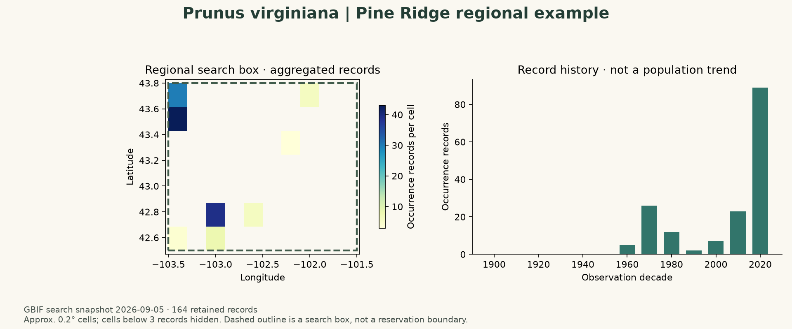

# Species occurrences near Lakota lands

Find and explore GBIF biodiversity records for a project starting selection of species: chokecherry, American bison, prairie turnip, black-billed magpie, black-tailed prairie dog and black-footed ferret. The worked example uses chokecherry in a regional search box near Pine Ridge. The same workflow can be adapted to Rosebud, Standing Rock or Cheyenne River with an explicitly chosen study area.

GBIF provides evidence of organisms recorded at particular places and times. Cultural relevance comes from community knowledge and appropriate sources. Add Lakota names and cultural descriptions with community-approved or cited context; this repository does not define an authoritative cultural species list or publish harvesting locations.



The preview shows aggregated record locations and collection history, not abundance, complete distribution or population change. The dashed outline is a **regional search box**, not the Pine Ridge Reservation boundary. [Preview provenance and source datasets](figures/README.md).

## Run the example

```sh
conda env create -f environment.yml
conda activate olc-gbif
jupyter lab notebooks/01_species_occurrences.ipynb
```

Run all notebook cells. The default selection is *Prunus virginiana*, years **1900–2025**, and bbox **(-103.5, 42.5, -101.5, 43.8)** in longitude/latitude order. Change the name, years and bbox in the parameter cell. The notebook saves raw records and provenance in ignored `data/`, and the new figure in ignored `outputs/`. The committed preview is an intentionally selected aggregate example.

The notebook produces a map, records-by-decade chart, and a quality summary with record types, missing dates, coordinate uncertainty and exclusions. No records is a valid result and produces an explanatory figure. Results exceeding the 3,000-record teaching cap stop before plotting; narrow the selection or use an official download. Network errors and rate limits retry briefly and then fail clearly. A matching cache is reused; `REFRESH=True` preserves the old cache and saves a separately named new snapshot.

## Choose and verify a species

[species.csv](species.csv) records the queried name, matched name/key, accepted name/key and verification timestamp for all six starting species. The notebook resolves the name again when creating a new snapshot. A synonym match is preserved along with its accepted name; ambiguous or non-species matches require review. Numeric keys are tied to a taxonomy and should not be copied blindly between checklists.

Prairie turnip has appeared under *Psoralea esculenta* as well as *Pediomelum esculentum*. Use the resolved accepted key in the current table. The original species list is a starting point for discussion; ecological interest and cultural significance should be documented separately.

## Get data using the GBIF website

1. Open [GBIF Occurrence Search](https://www.gbif.org/occurrence/search) and select the taxon, checking the scientific name and taxonomy.
2. Select the year range and records with coordinates; review geospatial issues and record types.
3. Draw a map polygon for a regional query. Record the bounds/geometry. A reservation name in free-text search does not define a reservation polygon.
4. For records within a reservation, obtain the appropriate boundary, document its source and vintage, and use a spatial query or clip the downloaded points to that polygon. Reproject coordinates consistently before clipping. Keep a regional bbox and an exact boundary distinct.
5. Sign in to request an official download. Choose Simple CSV for a compact table or Darwin Core Archive for richer source material. Preserve the query and download DOI shown when it finishes.

The [GBIF download guide](https://techdocs.gbif.org/en/data-use/api-downloads) explains account requirements, spatial predicates and download status. Its API also supports bulk requests; keep credentials outside notebooks and Git. Official downloads are asynchronous and their completed metadata includes a download DOI.

## Get a small sample with Python

The notebook uses the Python standard library for GBIF requests and pandas/Matplotlib for summaries. From the repository root:

```python
from src.occurrences import retrieve, draw_summary

snapshot = retrieve(
    "Prunus virginiana",
    bbox=(-103.5, 42.5, -101.5, 43.8),
    years=(1900, 2025),
    data_dir="data",
)
figure, quality = draw_summary(snapshot, "outputs/chokecherry.png")
print(quality)
```

[GBIF search](https://techdocs.gbif.org/en/openapi/v1/occurrence) allows at most 300 records per page, with an overall search ceiling. This example follows pages and applies its smaller teaching cap. Search snapshots do not receive a download DOI. For a reproducible publication export, request an official download and retain its DOI rather than describing a search CSV as a DOI-bearing dataset.

## Quality, geography and time

- Queries require coordinates, no reported GBIF geospatial issue, present occurrence status and the chosen year range. Undated/unlocated records are excluded before retrieval; the quality counts describe the filtered subset.
- Local checks exclude fossil and living-specimen records and invalid/out-of-box coordinates or years. GBIF-key deduplication is not a full cross-dataset duplicate-specimen audit.
- Preserve event dates, basis of record, identifiers, uncertainty, licenses and source dataset keys. Missing coordinate uncertainty does not mean precise coordinates.
- Maps use approximately 0.2-degree bins and hide cells with fewer than three records. Angular bins are not equal-area density estimates. The decade chart includes all retained records, including those hidden from the map.
- A museum collection's publication date differs from its specimens' collection dates. Irregular records have no uniform spatial resolution or revisit interval. Changes in record counts can reflect sampling/publication effort.
- Use relevant community and species-sensitivity guidance before sharing a new map. Public occurrence availability does not establish permission to add or disclose community-held knowledge.

## Regional source and attribution

The [Chadron State College High Plains Herbarium](https://www.gbif.org/dataset/97695324-8a6d-4a1c-98aa-16dbac2eb167) includes regional botanical collections. Its stated emphasis includes the **Nebraska Pine Ridge escarpment**, southwestern South Dakota and eastern Wyoming; determine actual reservation coverage through a spatial query. Its GBIF dataset page lists its citation and license, which must be checked for the version used.

Cite the official GBIF download DOI when available and credit contributing datasets under their terms. For this preview, [figures/README.md](figures/README.md) lists contributing dataset pages and snapshot provenance. The repository [MIT license](LICENSE) covers its original code/documentation; it does not relicense source records. Raw data, exact points and credentials stay outside version control.

## Repository contents

- `species.csv`: verified name matches and the project starting selection.
- `notebooks/01_species_occurrences.ipynb`: the complete teaching workflow.
- `src/occurrences.py`: reusable request, pagination, quality and plotting helpers.
- `figures/`: aggregate README preview and attribution.
- `tests/`: offline checks of pagination, bounds and empty results.

Run `python -m unittest discover -s tests` for offline checks. See [validation.md](validation.md) for the recorded live example and notebook execution.
